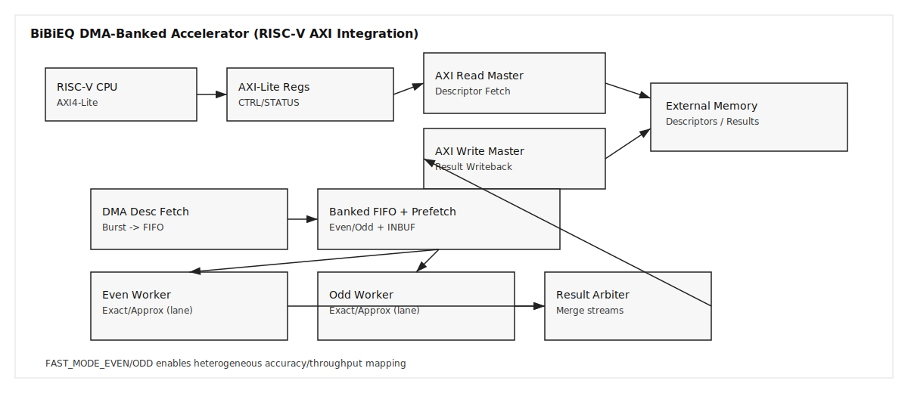

# BiBiEQ DMA-banked accelerator (RISC‑V AXI integration)

This is the **RISC‑V SoC–friendly** version of the BiBiEQ-inspired Verilog project. It keeps the same banked FIFO + dual worker core but wraps it with:

- **AXI4‑Lite control/status** (CPU‑visible registers)
- **AXI4 master DMA** for descriptor fetch (read) and result writeback (write)

The core processing pipeline, data formats, and algorithmic structure are the same as the original project; this version focuses on SoC integration.

## Top module

- `rtl/bibieq_dma_banked_riscv_top.v`
- `rtl/bibieq_dma_banked_riscv_fast_top.v` (FAST mode)

## Architecture overview

## Throughput-optimized (FAST) variant

The paper at arXiv:1511.06530 focuses on **compressing CNNs** with rank selection (VBMF), Tucker decomposition, and fine‑tuning to reduce runtime/energy with a small accuracy loss.  
We apply the same high‑level idea—**approximate/compact computation for speed**—by providing a FAST mode that **disables the Exact engine** and outputs only the Approx path. This removes Exact‑path logic from the critical path, which can improve achievable clock/throughput at the cost of accuracy.

How to use:

- Instantiate `rtl/bibieq_dma_banked_riscv_fast_top.v`, or
- Set `FAST_MODE=1` on `rtl/bibieq_dma_banked_riscv_top.v`

## Applied papers from SNU SHA (project-integrated)

### 1) Bank‑aware prefetch buffering (multi‑bank memory management)

The multi‑bank memory management work for CNN accelerators emphasizes **using multiple banks to reduce access delay** and **prefetching into available banks** to hide memory latency.  
Applied here: `dual_bank_fifo` now includes **per‑bank input prefetch buffers** (`INBUF_DEPTH`, `INBUF_PTR_W`) that decouple DMA fetch from bank fullness. This reduces stall risk when a burst encounters an imbalanced even/odd pattern.

### 2) Heterogeneous lane mapping (SDF scheduling on multiprocessors)

The SDF‑based scheduling papers discuss **mapping dataflow graphs onto multiple (potentially heterogeneous) processors** and using scheduling strategies to improve throughput.  
Applied here: the core now supports **per‑lane FAST/EXACT configuration** via `FAST_MODE_EVEN` and `FAST_MODE_ODD`, enabling a heterogeneous “fast+accurate” mapping if you want to trade accuracy for throughput asymmetrically.

## References

- “Compression of Deep Convolutional Neural Networks for Fast and Low Power Mobile Applications,” arXiv:1511.06530.
- “Multi‑Bank On‑Chip Memory Management Techniques for CNN Accelerators,” *IEEE Transactions on Computers*, 2022.
- “Hierarchical Scheduling of an SDF/L Graph onto Multiple Processors,” *ACM Transactions on Embedded Computing Systems*, 2022.
- “Parallel Scheduling of Multiple SDF Graphs onto Heterogeneous Processors,” *IEEE Access*, 2021.

## Interfaces

### AXI4‑Lite (control/status)

A 32‑bit AXI4‑Lite slave provides configuration and status.

**Register map (byte offsets)**

- `0x00` **CTRL** (W1P)
  - bit0: `START` (write 1 to launch; self‑clears)
  - bit1: `CLR_DONE` (write 1 to clear done sticky)
  - bit2: `SOFT_RESET` (write 1 to pulse core reset)
- `0x04` **STATUS** (RO)
  - bit0: `BUSY`
  - bit1: `DONE_STICKY`
  - bit2: `FETCH_DONE` (pulse)
  - bit3: `STORE_DONE` (pulse)
- `0x08` **DESC_BASE** (RW) — base address for descriptors
- `0x0C` **DESC_COUNT** (RW) — number of 64‑bit descriptors
- `0x10` **RD_BURST_LEN** (RW) — burst length in beats (1–255)
- `0x14` **RESULT_BASE** (RW) — base address for results
- `0x18` **EVEN_LEVEL** (RO) — even FIFO fill level (LSBs)
- `0x1C` **ODD_LEVEL** (RO) — odd FIFO fill level (LSBs)

**Start sequence**

1. Program `DESC_BASE`, `DESC_COUNT`, `RD_BURST_LEN`, `RESULT_BASE`
2. Write `CTRL.START = 1`
3. Poll `STATUS.DONE_STICKY` (or `STATUS.BUSY`)
4. Optionally write `CTRL.CLR_DONE = 1` to clear the sticky bit

### AXI4 master (DMA)

- **Read master**: issues bursts for descriptor fetch
- **Write master**: streams 64‑bit results back to memory

Notes:

- Read bursts use `ARLEN = RD_BURST_LEN - 1` and `ARSIZE = log2(DATA_W/8)`.
- Write path uses **single‑beat bursts** (AWLEN = 0). This is simple but not peak‑bandwidth optimal.

## Cycles-per-second (throughput) metric

Define a CPS-style throughput in **descriptors per second**:

- `clk_hz`: SoC clock frequency in Hz
- `cycles_per_desc`: measured cycles needed per descriptor (end-to-end)
- `desc_per_cycle` = `1 / cycles_per_desc`
- `desc_per_sec` = `clk_hz * desc_per_cycle`

For a quick estimate, you can also use the **sustained descriptors/cycle** number:

- `desc_per_sec` = `clk_hz * sustained_desc_per_cycle`

If the even/odd banks are balanced and DMA is not the bottleneck, sustained throughput can approach **~2 descriptors/cycle**. If banking is imbalanced or memory backpressure is high, it will be closer to **~1 descriptor/cycle**.

## Directory structure

### Core modules (unchanged)

- `rtl/bb_phase_router.v`
- `rtl/ec_schedule_ctrl.v`
- `rtl/posterior_calc.v`
- `rtl/engine_exact.v`
- `rtl/engine_approx.v`
- `rtl/segment_processor.v`
- `rtl/lfsr16.v`
- `rtl/dual_bank_fifo.v`
- `rtl/segment_worker.v`
- `rtl/dma_desc_fetch.v`
- `rtl/result_arbiter.v`
- `rtl/dma_result_writeback.v`
- `rtl/bibieq_dma_banked_top.v` (core without AXI)

### RISC‑V/AXI wrappers (new)

- `rtl/axi_lite_regs.v` — AXI4‑Lite register block
- `rtl/axi_read_master.v` — AXI4 read‑DMA bridge
- `rtl/axi_write_master.v` — AXI4 write‑DMA bridge
- `rtl/bibieq_dma_banked_riscv_top.v` — SoC‑ready top
- `rtl/bibieq_dma_banked_riscv_fast_top.v` — SoC‑ready top (FAST mode)

## Data formats

### Descriptor format (`64-bit`)

- `[63:56]` : `seg_idx`
- `[55]`    : `use_4ec`
- `[54:52]` : `phase`
- `[51:49]` : `r`
- `[48]`    : `ds`
- `[47:32]` : `e_q` (Q0.16)
- `[31:16]` : `q_q` (Q0.16)
- `[15:12]` : `u`
- `[11:8]`  : `v`
- `[7:0]`   : reserved

### Result format (`64-bit`)

- `[63:56]` : `seg_idx`
- `[55]`    : `checkpoint_valid`
- `[54:53]` : `checkpoint_id`
- `[52:48]` : `exact_mask`
- `[47:43]` : `approx_mask`
- `[42]`    : `exact_first_hit_valid`
- `[41:39]` : `exact_first_hit_idx`
- `[38:23]` : `p_flag_q`
- `[22]`    : `x_valid`
- `[21]`    : `x_target_is_l`
- `[20]`    : `x_target_is_r`
- `[19:16]` : `x_u`
- `[15:12]` : `x_v`
- `[11]`    : `z_valid`
- `[10]`    : `z_source_is_l`
- `[9]`     : `z_source_is_r`
- `[8:5]`   : `z_u`
- `[4:1]`   : `z_v`
- `[0]`     : reserved

## Limitations and integration notes

- AXI write path is **single‑beat** for simplicity. If you need higher bandwidth, add burst aggregation in `axi_write_master.v`.
- No 4‑KB boundary protection is implemented for bursts.
- Assumes descriptor/result buffers are **DATA_W‑aligned**.
- AXI‑level testbench is functional (not a full protocol‑compliance suite).

## Verification and coverage

An AXI‑level testbench is included to improve functional coverage of the SoC wrapper:

- `tb/tb_bibieq_dma_banked_riscv_axi.v`

It provides:

- AXI‑Lite register programming and polling
- AXI read/write memory model with backpressure
- Scoreboard checks (result count, address ordering, seg_idx set, FAST‑mode exact fields)
- Coverage counters for parity, `use_4ec`, `phase`, `r`, `ds`, burst bins, FIFO high‑watermark hits, and backpressure cycles

Run:

- `make tb_riscv_axi`
- `make tb_riscv_axi_fast` (FAST mode)

Optional plusargs:

- `+DESC_COUNT=...`
- `+BURST_LEN=...`
- `+SEED=...`

## Metastability protection

Asynchronous inputs are synchronized before they enter the core logic:

- `aresetn` is synchronized (async assert, sync deassert) via `rtl/reset_sync.v`
- The core `start` signal is passed through a 2‑FF synchronizer (`rtl/sync_2ff.v`) inside `bibieq_dma_banked_top.v`

If `start` is generated in the same clock domain, the synchronizer only adds a small (2‑cycle) latency.

## Toggle reduction (clock enable / glitch reduction)

To reduce unnecessary internal switching, `segment_worker` gates its descriptor decode when idle:

- `IDLE_GATE=1` (default) masks `desc_data` unless a valid transfer fires.
- This prevents combinational logic (router/schedule/posterior/engine) from toggling when no descriptor is being accepted.

You can disable this by setting `IDLE_GATE=0` at the top‑level if needed for debug/visibility.

## Suggested next steps

1. Add burst aggregation on the write path
2. Add 4‑KB boundary checks for read bursts
3. Wrap with AXI4‑Stream if your SoC uses streaming DMA
4. Build a C driver for the register map and integrate in your RISC‑V firmware
